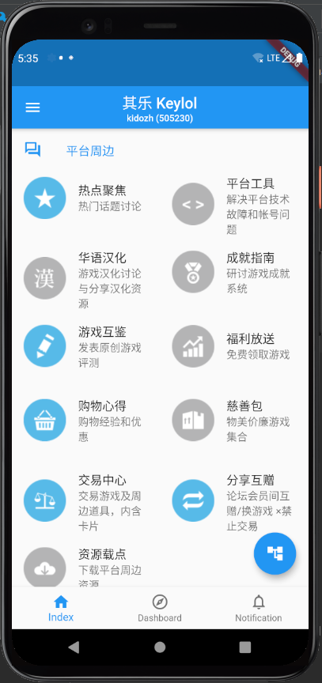
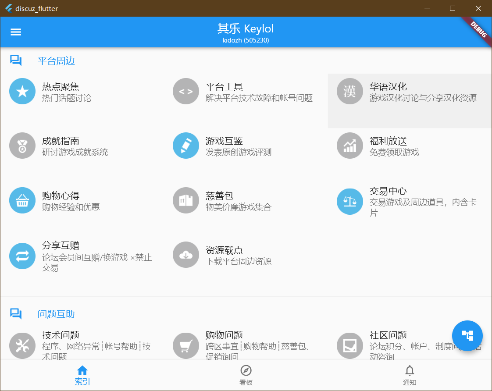

# 简介

我们很高兴的宣布，我们正在开发基于Flutter技术的Discuz客户端。由于Flutter的引入，我们的客户端目前可以运行在多个系统上。

我们重新整理了接口，移除了一些不使用的冗余接口，使得访问更加轻量化。但是我们仍然推荐Android用户使用Discuz Hub以获得原生级服务。

## 查看进度

您可以在Github上围观我们的施工现场

[Discuz Flutter](https://github.com/kidozh/discuz_flutter)

我们预计为以下操作系统的用户提供支持和服务

+ Android
+ Windows
+ Linux（Ubuntu）

等到我们拥有了`Mac Mini`后，我们在长远预计为`iOS`和`MacOS`用户提供支持和协助。目前没有编译计划。

> 为了补偿在iOS上的年费**99**刀，我们预计会在iOS上引入由**Google**提供的广告。Android用户可以使用Discuz Hub，我们对于Discuz Hub在可预期的未来都没有植入广告的计划。

# 在Android设备下的截图

> 以下示例使用的是Keylol，请注意我们与其并未关系。

# 在Windows设备下的截图

> 以下示例使用的是Keylol，请注意我们与其并未关系。

我们目前还在针对以下功能进行适配

+ 验证码服务
+ 热帖
+ Webview服务

请注意这并不代表我们的最终产品。最终产品形态可能随着计划的更改变动甚至取消。

感谢您对于我们的支持。

# 赞助我们的工作

您可以通过微信支付和支付宝赞助我们的工作。在此表示谢意！

请参考此链接[赞助我们](/sponsor-us)

