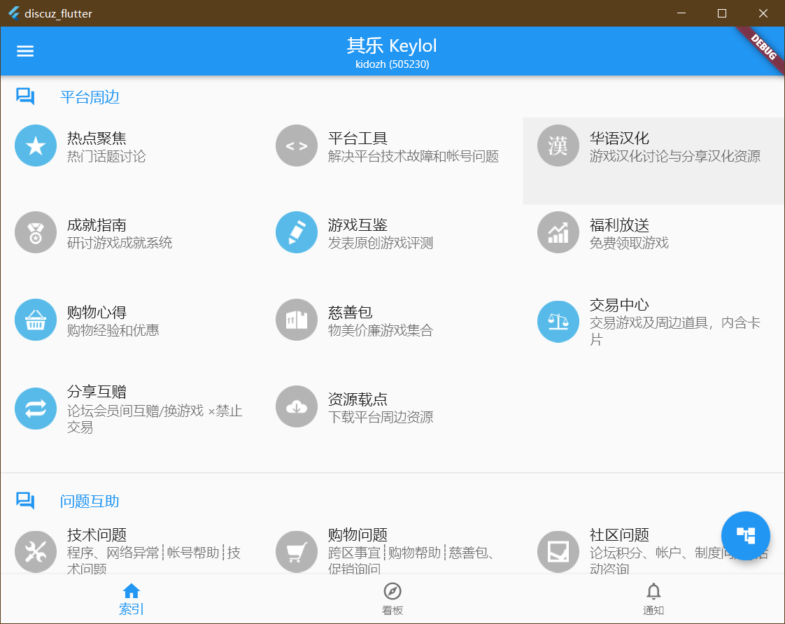

# 简介

我们很高兴的宣布，我们开发的基于Flutter技术的Discuz客户端（命名为谈坛，DisFly），即将上架Google Play。

此客户端能够运行于Windows，iOS以及Android客户端，我们预计将在不久之后上线App Store以及微软的Microsoft Store。

我们即将建立谈坛的新站，届时关于谈坛的信息将会迁移至新站发布，不再与Discuz Hub公用站点。

## 查看进度

您可以在Github上围观我们的施工现场

[Discuz Flutter](https://github.com/kidozh/discuz_flutter)

您可以在Play商店下载我们的应用

[谈坛 - 从Google Play下载](https://play.google.com/store/apps/details?id=com.kidozh.discuz_flutter)

您也许可以在App Store下载我们的应用（Under Review）

[谈坛 - 从App Store下载](https://apps.apple.com/us/app/%E8%B0%88%E5%9D%9B/id1601703772)

我们预计为以下操作系统的用户提供支持和服务

+ Android
+ Windows(算了，你们直接访问网页更快，就不做适配了蛤)
+ MacOS
+ iOS / iPad OS

# 在Android设备下的截图

> 以下示例使用的是Keylol，请注意我们与其并未关系。

# 在Windows设备下的截图

> 以下示例使用的是Keylol，请注意我们与其并未关系。

请注意这并不代表我们的最终产品。最终产品形态可能随着计划的更改变动甚至取消。

感谢您对于我们的支持。

# 赞助我们的工作

您可以通过微信支付和支付宝赞助我们的工作。在此表示谢意！